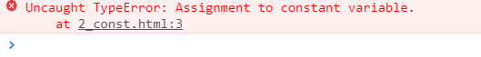
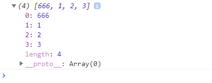
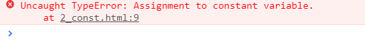
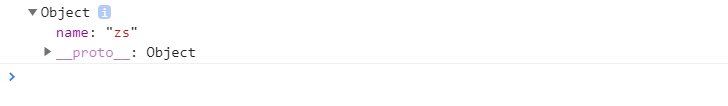

#2_const关键字的声明
##const 的用法：

#####const拥有let相同的四点
1. const没有变量提升
2. const不能重复命名
3. 块级作用域
4. 临时失效区 （暂时性死区） 当前作用域不允许同名的变量进
######不同之处：
5. const是用来定义常量的,基本数据类型用const定义不可以修改，引用数据类型 地址不能修改（地址中存的内容是可以修改的）如果内容不想修改用 Object.freeze(obj)方法冻结

#####1.基本类型用const定义，修改同名定义值
 ```

 const a = 10;
 a =20;
 console.log(a);
 ```
1_结果：


#####2.引用类型用const定义，修改地址中存的值
```
 const arr = [0,1,2,3];
 arr[0]=666;
 console.log(arr);
```
2_结果：


#####3.引用类型用const定义，修改地址
```
 const arr = [0,1,2,3];
 arr=[1,2,3,4];
 console.log(arr);
```
结果：


#####4.引用类型用const定义，内容不想修改用 Object.freeze(obj)方法冻结

```
 const obj ={
     name :'zs'
 }
 //冻结阻止更改
 Object.freeze(obj);
 obj.name ='lisi';
 console.log(obj)
```
结果：



