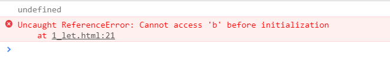
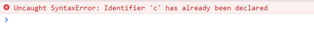
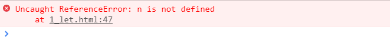
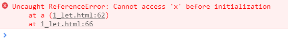

#1_let.md 

****let和var 都是用来定义变量的关键字，var是JavaScript的声明方式，而let是ECMAScript6的声明方式***
##let 和 var的区别
1. let没有变量提升
2. let不能重复命名
3. 块级作用域
4. 临时失效区 （暂时性死区） 当前作用域不允许同名的变量进
   
#####1.变量提升 (当前作用域的上边 定义了 没有赋值 ，值为undefined)
```
console.log(a);  // a为undefined，变量提升定义了但没赋值 
var a = 10;
console.log(b);  //报错因为let定义变量无变量提升
let b = 10;
```
结果：


#####2.let不能重复命名 var可以重复命名
```
var c = 10; 
var c = 20;console.log(c); // var可以重复命名但是后面的会覆盖前面的
```
结果：20
```
let c = 10;
let c = 20;
console.log(c);
```
结果：


#####3.块级作用域

```
  var m = 5;
    if(m){
       var n = 100;     //var只有全局作用域和函数作用域（非函数作用域即为全局作用）
     }

 console.log(n);
```   
结果：100
```
var m = 5;
    if(m){
    let n = 100;    //块级作用域带花括符即为块级作用域
         }
  console.log(n);

```
结果：

#####4.临时失效区 （暂时性死区） 当前作用域不允许同名的变量进入
```

         
          var x = 10;
          function a(){
              //相当再此声明   var x;
              console.log(x);  //undefined
              var x = 20; //函数中x会在当前作用域 变量提升 ，值为undefined
          }
          a();
```
结果：undefined
```
        var x = 10;
        function a(){
           //let定义后不允许同名的变量进入 此区域为暂时性死区
            console.log(x);
            let x = 20;
        }
        a();
```
结果：



